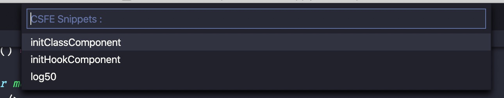

# Aliyun CSFE vscode workbench for Visual Studio Code

Aliyun CSFE vscode workbench for Visual Studio Code

## Usage

### Preparation

1. Open your project `File > Open > your porject`

### Features

1. Menus

   

2. Code Snippets
   

3. Run shells

## Contributing

TODO

## License

TODO
